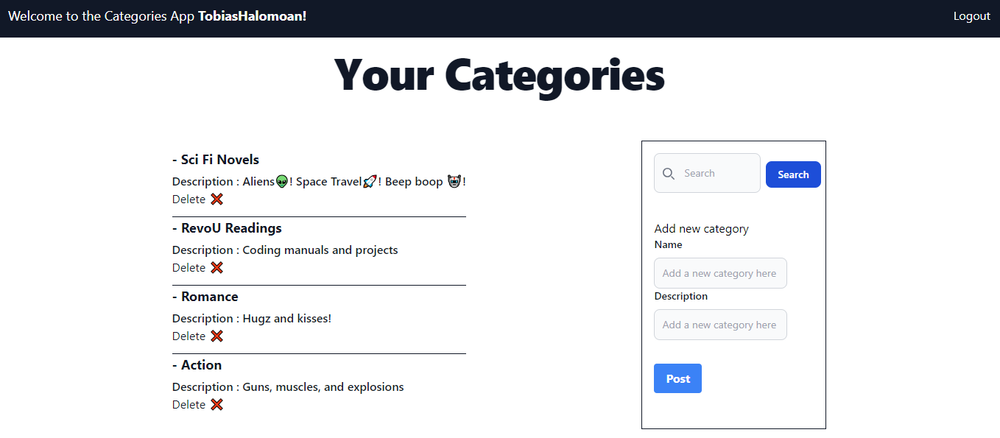

# Toby's React Categories App

### Module 4 Assignment for RevoU FSSE Amsterdam

#### By Tobias Agyasta (Team 2)

[Live Netlify Link](https://tobys-categories.netlify.app/)

## Dependencies

- This project was made with [React](https://react.dev/) and [Typescript](https://www.typescriptlang.org/)
- This project was bootstrapped with [Create React App](https://github.com/facebook/create-react-app).
- This project uses [npm](https://www.npmjs.com/) to manage libraries, packages, and modules.
- This project uses [Formik](https://github.com/jaredpalmer/formik) for creating quick and easy to manage forms.
- This project fully uses [Tailwind CSS](https://github.com/tailwindlabs/tailwindcss) for its css styles.
- This project uses [Yup](https://www.npmjs.com/package/yup) for form input validation, and [Yup-password](https://www.npmjs.com/package/yup-password) for strong password validation
- This project uses [react-router](https://reactrouter.com/en/main) to route between different pages.
- This project uses [library crud vercel API](https://documenter.getpostman.com/view/15804286/2sA3Bn6CSh) for the back end.

## How to Open

Using git, you can clone and open the repository using the following command in git bash on your preferred local folder:

```console
git clone https://github.com/RevoU-FSSE-4/module-4-tobiasagyasta.git

cd module-4-tobiasagyasta
```

Then, you can start the **development version** of the application by running

```console
npm start
```

Or, you can run the **build version** by using npm and [serve](https://www.npmjs.com/package/serve) by running

```console
npm run build

serve -s build
```

Otherwise, you can open the build version directly from the Netlify deployment on the top of this page.

## About



This is a CRUD application to manage categories for books built using React and Typescript for RevoU's Software Engineering course.

It uses a custom back-end to handle user data as well as categories data.

The application has the following features:

1. Responsive form sign up and sign in forms, created using Formik and Tailwind.
2. Strict form validation for sign up using Yup and Yup-password, with each field being required and containing other rules.
3. User authentication in the API using bearer tokens. Bearer tokens are stored in the localStorage for now.
4. Add, Update, and Delete categories.
5. Individual category data is kept for each user.
6. A simple search bar that highlights category names for filtering.
