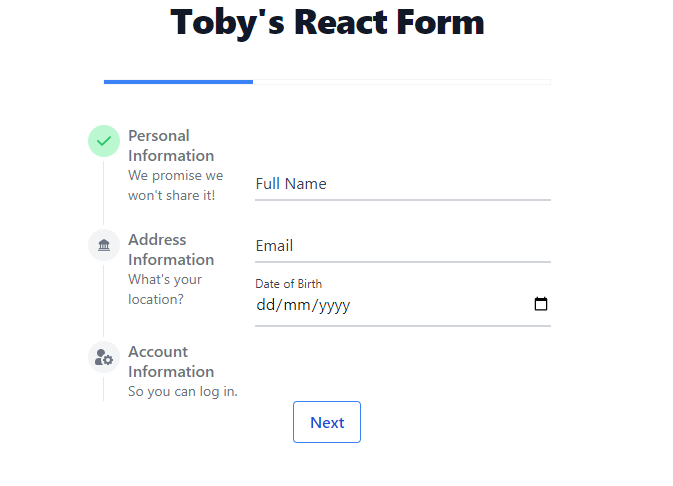

# Toby's React Form App

### Module 4 Assignment for RevoU FSSE Amsterdam

#### By Tobias Agyasta (Team 2)

[Live Netlify Link](https://tobys-form.netlify.app/)

## Dependencies

- This project was made with [React](https://react.dev/) and [Typescript](https://www.typescriptlang.org/)
- This project was bootstrapped with [Create React App](https://github.com/facebook/create-react-app).
- This project uses [npm](https://www.npmjs.com/) to manage libraries, packages, and modules.
- This project uses [Formik](https://github.com/jaredpalmer/formik) for creating quick and easy to manage forms.
- This project fully uses [Tailwind CSS](https://github.com/tailwindlabs/tailwindcss) for its css styles.
- This project uses [Yup](https://www.npmjs.com/package/yup) for form input validation, and [Yup-password](https://www.npmjs.com/package/yup-password) for strong password validation

## How to Open

Using git, you can clone and open the repository using the following command in git bash on your preferred local folder:

```console
git clone https://github.com/RevoU-FSSE-4/module-4-tobiasagyasta.git

cd module-4-tobiasagyasta
```

Then, you can start the **development version** of the application by running

```console
npm start
```

Or, you can run the **build version** by using npm and [serve](https://www.npmjs.com/package/serve) by running

```console
npm run build

serve -s build
```

Otherwise, you can open the build version directly from the Netlify deployment on the top of this page.

## About



This is a form application built using React and Typescript for RevoU's Software Engineering course.

It is currently only client-side and front-end but will be developed for the back-end in the long run.

The application has the following features:

1. Multistep responsive form, created using Formik and Tailwind.
2. Strict form validation using Yup and Yup-password, with each field being required and containing other rules. A step will not be completed if you did not provide the correct values.
3. Dynamic progress bar above the form that shows the progress throughout the multi-step form.
4. Dynamic sidebar that shows the current step and the information for all the steps.
